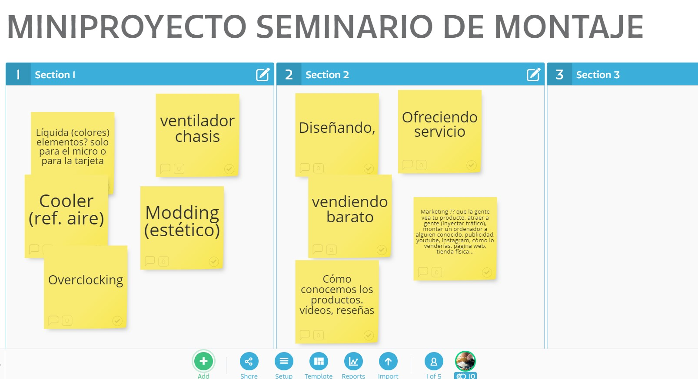

# Refrigeración Pc

### INTRO

---

### Preguntas iniciales

* ¿Qué sabes de la refrigeración del PC? ¿Crees que es importante?

* ¿Cuál es la mejor refrigeración? ¿Por qué?

* ¿Es algo caro?

* ¿Que interesa algo sencillo y que cumpla? o algo más friki

* ¿Qué refrigeración prefiere la gente? ¿Cómo lo sabes? ¿Cómo podemos saberlo qué fuentes consultar?

* Si mañana quisieramos realizar ventas online o físicas de PCs cómo podemos atraer a la gente a nuestros productos

* Se puede comparar cooler con refrigeración líquida

* Las frikezas en estos temas

* ¿Cómo afecta el overclocking a la refrigeración?

* ¿La fuente de alimentación es importante?

* ¿Qué elemento genera más calor?

* ¿La caja ayuda a refrigerar? ¿Qué otros aspectos hay que tener en cuenta?

* ¿Dónde buscar información? ¿Las reseñas de usuarios son útiles?

* ¿Qué puedo hacer con esto?

--- 

# DÍA 1 21/04/2020 ENTREGA: LOS COORDINADORES ME ENTREGARÁN UN CORREO CON LA TOMA DE DECISIONES ELABORADA POR EL GRUPO

* Puede entregarse un documento.
* Detallar en el correo o documento: Cúal es la idea del grupo.
* Importante líneas de investigación sobre el tema.
* Conslusiones las aque habéis llegado.
* Todo tipo de ideas, mañana las trabajaremos por grupos.
* Qué queréis entregar, cómo vais a enfocar las ideas, con qué trabajos (vídeos, tutoriales, pagina web...)
* Cómo váis hacer la presentación.
* En qué necesitáis que os ayude.

PRÓXIMA SESIÓN: JUEVES 23/04/2020 - Planificación del proyecto, creación de tareas, etc... (Trabajo por grupo)

**RECORDAD TAMBIÉN QUE EL TRABAJO Y PARTICIPACIÓN EN LA CLASE ONLINE IMPLICA UN 30% DE LA NOTA FINAL**

---
### IDEAS GENERADAS EN EL BRAINSTORMING DEL PROYECTO

### Disipadores

* https://www.pccomponentes.com/tipos-disipador-cpu-instalacion
* https://www.pccomponentes.com/mejorar-refrigeracion-pc

### Refrigeración cooler

* https://www.opirata.com/blog/tipos-de-ventiladores-pc-guia-completa/

### Refrigeración líquida

* https://www.pcspecialist.es/liquid-series/

### Ventiladores cajas y fuentes de alimentación

* https://www.pccomponentes.com/ventiladores
* https://www.pccomponentes.com/cajas-pc

# ENTREGA DEL TRABAJO

Tiene que entregarse mediante un soporte informático y que se pueda visualizar por internet

* Blog
* Página Web
* Drive Presentation

# REDES SOCIALES
Twitter y hay que escribir con etiquetas #FP #SMIR #MONTAJEPC @fppracticas
Pueden ser otras redes sociales (pero lo tenéis que comentar para que os diga las normas para escribiry postear)

# PRESENTACIÓN DEL TRABAJO

Se grabará y se realizará un directo desde el canal de Youtube o bien se grabará
Todo el equipo tendrá que hablar durante la charla
